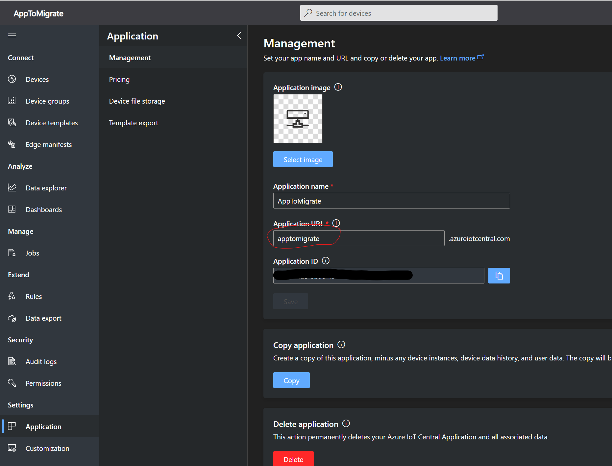
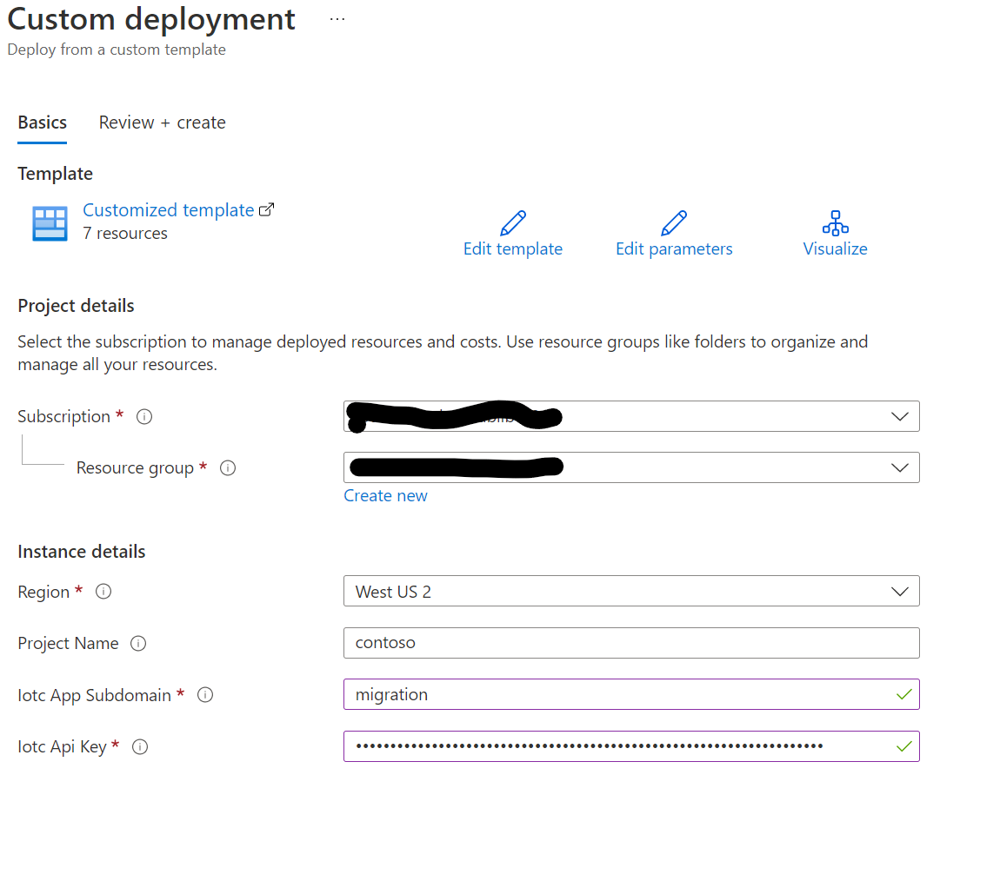
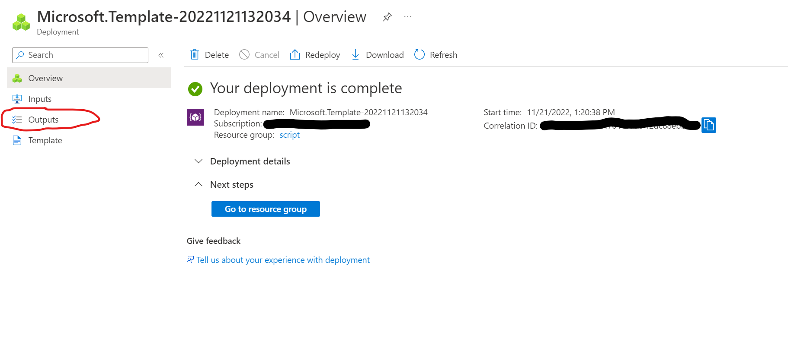
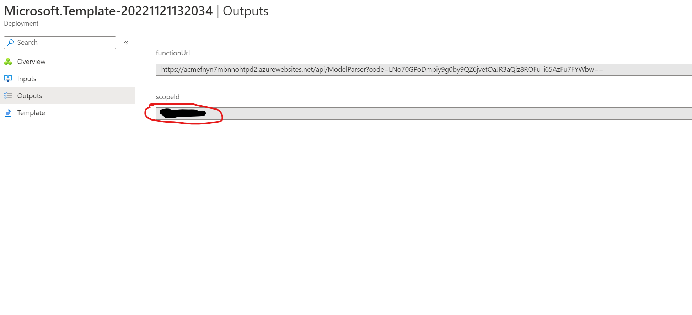
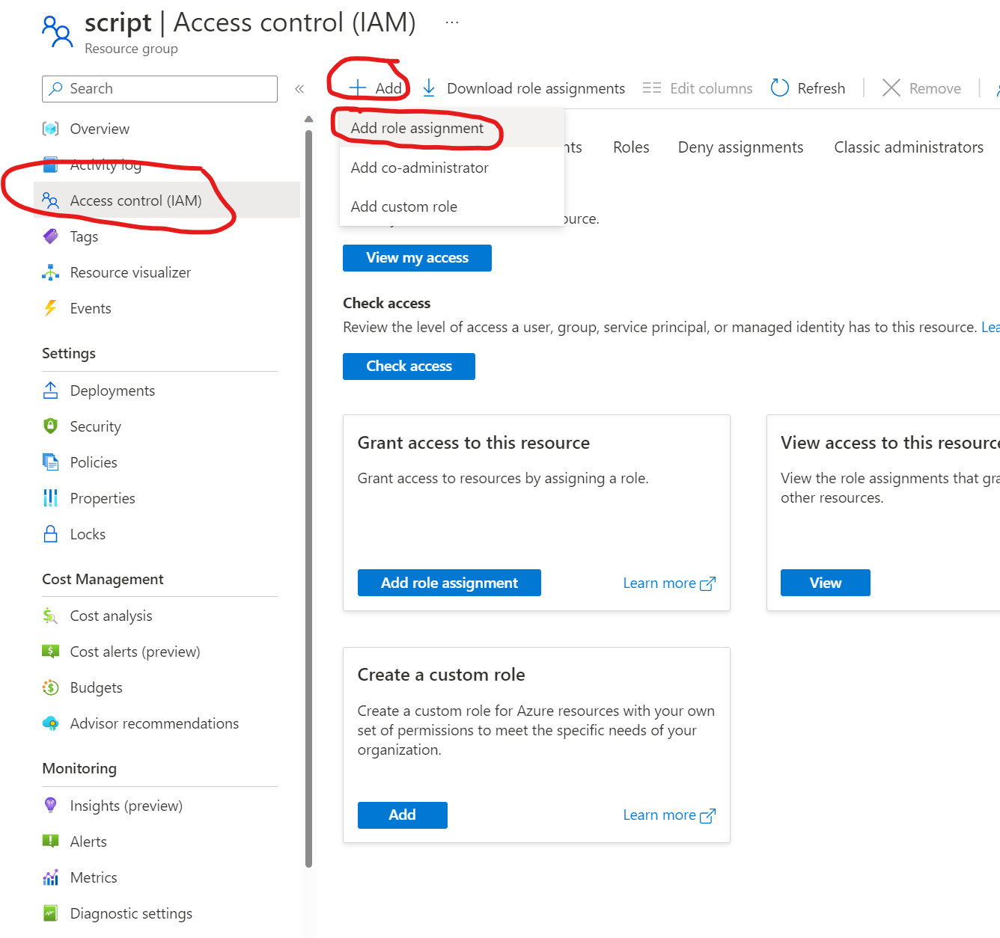
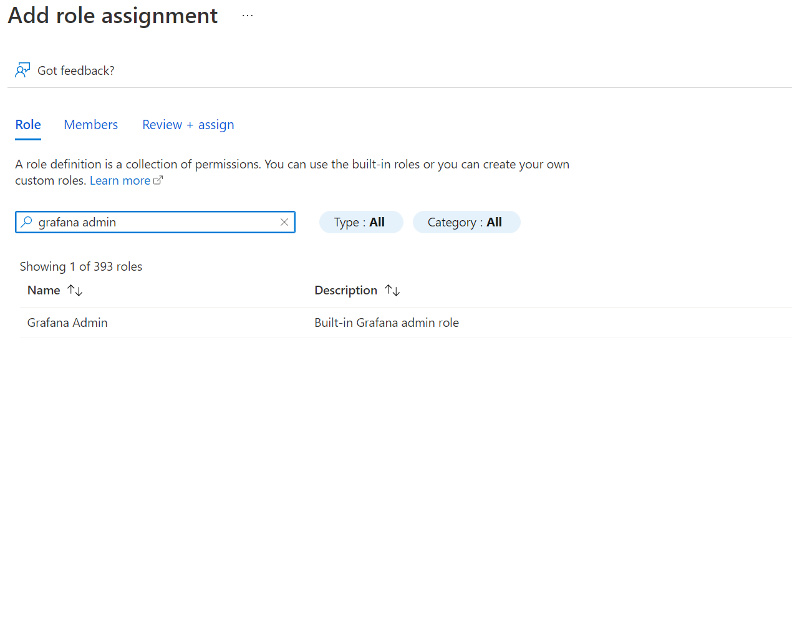
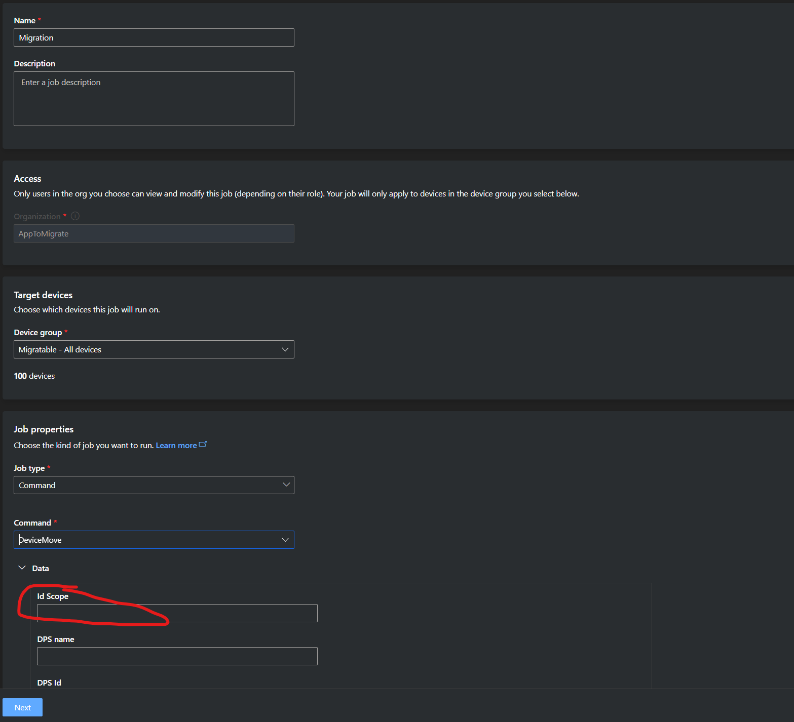

# Azure IoT Central to PaaS migration tool

A simple, managed solution 

## Requirements

1. Azure Subscription
2. Azure IoT Central application and API Key
3. Compatible IoT Central device templates (see [Prepare IoT Central Application and devices](#prepare-iot-central-application-and-devices).)

## Limitations
- Currently the tool does not support migration of devices authenticating through x509 certificates but SAS keys only.
- The whole tool is based on the concept of "device template". Unassigned devices are currently not supported.
- Dashboard customizations in the IoT Central application are not automatically applied to grafana dashboards.

## 1. Fetch details.

In order to automate the migration process, the tool utilizes IoT Central API tokens to interact with an application.
Please create an API token or reuse an existing one with "App Administrator" role.

Follow official instructions on how to create an API token in IoT Central [here](https://learn.microsoft.com/en-us/rest/api/iotcentral/authentication#api-token).

Also note down the application subdomain, you can find it under the "Application" page in the IoT Central application.



## 2. Create resources

This repository contains an automated script which creates and configures all required Azure resources in one click.
Hit the "Deploy to Azure" button below to start provision the tool.
Give project a name to be used as a prefix for all resource names and both application subdomain and API token as detailed in previous step.
Once deployment ends, go to the "Outputs" section and copy the new _scopeId_ to be used later in the setup.

[](https://portal.azure.com/#create/Microsoft.Template/uri/https%3A%2F%2Fraw.githubusercontent.com%2Fiot-for-all%2Fiotc-solution-migrator%2Fmain%2Fdeployments%2Fmain.json)





## 3. Access dashboards.

User designed to be the dashboards administrator must be granted with the "Grafana Admin" role. Open the resource group in Azure portal and add the role by searching for "_Grafana admin_" and assign it to the user.

> Roles may take up to an hour to propagate.
> Read [Dashboard](./docs/dashboards.md) instructions to access Grafana portal and manage users and organizations.




## 4. Start device migration

When you are ready to migrate your running devices create a _Job_ in the IoT Central application.
Open "Jobs->Create new job", give it a name, an optional description and select the target devices. IoT Central automatically creates device groups including all devices of specific templates. To work on a subset of devices, create your own groups.
Define the job properties like this:

```
Job Type = 'Command'
Command = 'DeviceMove'
Data->Id Scope = '[scopeId]'  // scopeId as shown in the deployment output
```



---

## Prepare IoT Central Application and devices.
This migration tool assumes the device templates in the application include the "Device Migration" component. You can download the DTDL component schema from [here](../raw/migration_component.json).

The device firmware must react to the "DeviceMove" command defined in the component above. A python sample is available in the [_device-sample_](./device_sample) folder.
