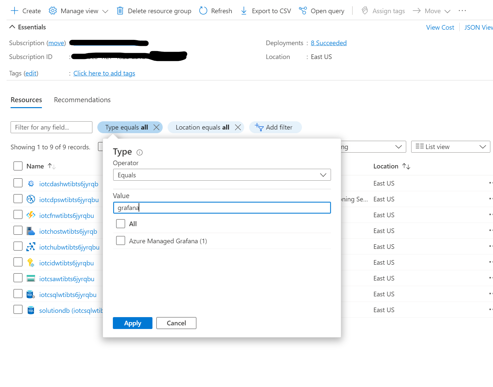

# Grafana Dashboards

## Access Grafana Portal
The following steps must be executed by the user who granted the "Grafana Admin" role for the resource group or subscription.

Other users and organizations can be added through Azure with RBAC as shown in the ["Granting access"](#grant-users-and-organizations-access) section.

1. Open the resource group you have deployed the solution to.
2. Filter by _"grafana"_ resources.
3. Open the portal using the "Endpoint URL".

## Grant users and organizations access
The managed Grafana solution used in this tool requires each member to be part of the Azure directory. To add users to the dashboard application use Azure IAM to do proper role assignment. The supported roles are _GrafanaAdmin_, _GrafanaEditor_, and _GrafanaViewer_.

### Add a user as "viewer" in Grafana

You can create teams and organizations and assign fine-grained permissions from the Grafana Portal as explained [here.](https://grafana.com/docs/grafana/latest/administration/user-management/)